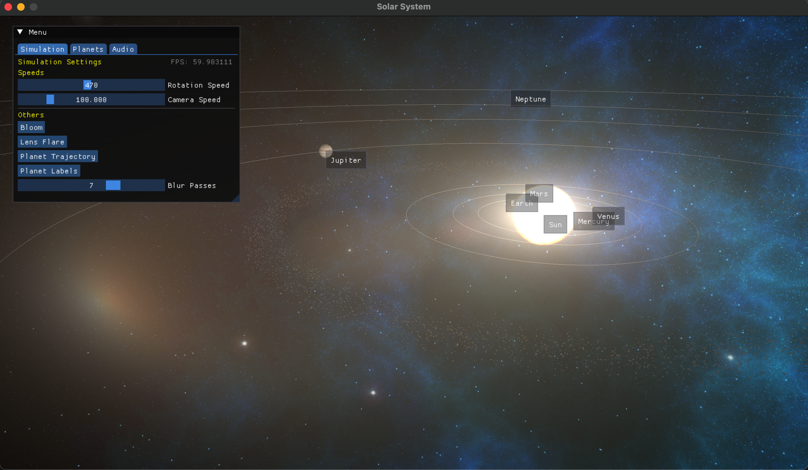
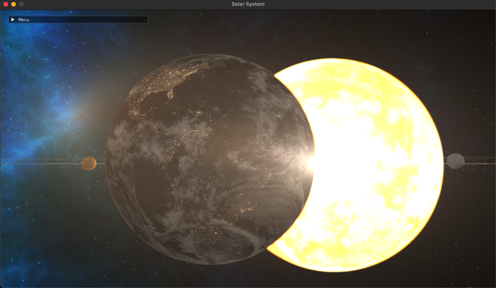
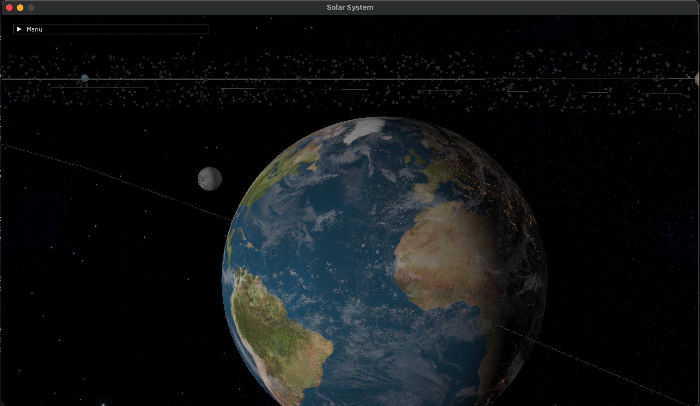

# Solar System

A Simulation of our Solar System made with OpenGL.

## Features

- [x] Planet Trajectories
- [x] Planet Labels
- [x] Earth
  - [x] Day and Night cycle
  - [x] Clouds 
  - [x] Moon
- [x] Asteroids with GPU Instancing
- [x] Skybox with Cubemaps
- [x] Post-processing Effects
  - [x] Lens-flare
  - [x] Bloom
  - [x] Auto-exposure
- [x] Ambient Music
- [x] Main Menu
  - [x] Individual Planet Cameras
  - [x] Speed Controls
  - [x] Turning Features On/Off
  - [x] Music Control

## Running

Simply run the provided script:
```bash
./run
```

It is assumed you have installed `OpenGL`, `glfw3`, `glew`, `glm` and `assimp` with a package manager and/or they are findable by `CMake`.

## Screenshots




## Credits

### Original Background Music

We do not own, distribute or profit off of this music.
If you wish to get the full experience, legally download the songs,
name them `"1.mp3"` through `"3.mp3"` in any order, and place them
in the `resources/others/` directory, 

- **Stone in Focus**
  - **Artist:** Aphex Twin
  - **Album:** Selected Ambient Works Volume II
  - **Label:** Warp Records

- **Rain**
  - **Artist:** Hans Zimmer
  - **Album:** Bladerunner 2049 Soundtrack
  - **Label:** Sony Music Entertainment

- **Sapperstree**
  - **Artist:** Hans Zimmer
  - **Album:** Bladerunner 2049 Soundtrack
  - **Label:** Sony Music Entertainment
